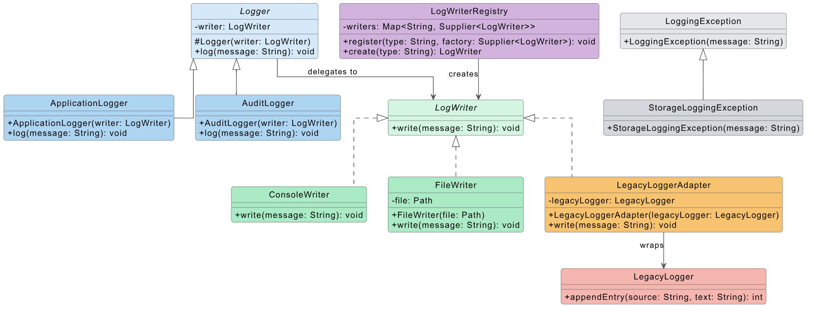

# Design Rationale

## 1. Problem Domain

This project is a simple logging system that supports different types of loggers and different ways of writing log messages.

The system has two logging abstractions: ApplicationLogger for application events and AuditLogger for audit events. Both can use different logging destinations through the LogWriter interface.

The supported writers are ConsoleWriter, FileWriter, and LegacyLoggerAdapter, which adapts an incompatible legacy logging class.

## UML Diagram

## 2. Bridge

The Bridge pattern separates the logging abstraction from the implementation used to store or output the log.

Logger is the abstraction, while ApplicationLogger and AuditLogger are refined abstractions. LogWriter is the implementor, with ConsoleWriter, FileWriter, and LegacyLoggerAdapter as concrete implementations.

This separation allows both hierarchies to evolve independently. For example, a new SecurityLogger can be added without modifying any LogWriter implementation. Similarly, a new DatabaseWriter can be added without modifying ApplicationLogger or AuditLogger.

Without Bridge, different logger types combined with different output methods could require many subclasses for every combination.

## 3. Adapter

The project also contains a legacy logging class called LegacyLogger.

LegacyLogger cannot directly implement LogWriter because its interface is incompatible with the target contract. It uses:

appendEntry(String source, String text)

and returns an integer status code instead of using the LoggingException based error mechanism defined by LogWriter.

The LegacyLoggerAdapter implements LogWriter and wraps LegacyLogger. It converts the new write(String message) call into the legacy appendEntry(...) call and translates legacy error codes into the project's logging exceptions.

The wrapped LegacyLogger is not modified.

## 4. Bridge and Adapter

Bridge and Adapter solve different problems in the same design.

Bridge allows different logger abstractions to work with interchangeable log-writing implementations. Adapter makes the incompatible legacy logger usable as one of those implementations.

Using Bridge alone would not make LegacyLogger compatible with LogWriter. The legacy class would still have a different method signature and error mechanism.

Using Adapter alone would make LegacyLogger compatible with LogWriter, but it would not provide independent variation between logger abstractions and logging implementations.

Therefore, the two patterns address two different parts of the same system.

## 5. Failure Translation

The LogWriter contract uses LoggingException for logging-related failures.

LegacyLogger uses integer status codes instead. LegacyLoggerAdapter translates these codes into meaningful exceptions such as StorageLoggingException and LoggingException.

This prevents legacy implementation details from leaking into the abstraction layer.

## 6. Dynamic Implementor Selection

This project uses the Dynamic Implementor Selection complexity module.

LogWriterRegistry stores factories for available LogWriter implementations. The implementation is selected at runtime from an input value such as console, file, or legacy.

The client requests a writer from the registry instead of directly selecting and constructing a concrete implementation.

## 7. Limitation

One limitation of this design is that implementations still have to be registered in the application composition code before they can be selected dynamically. The registry does not automatically discover new LogWriter implementations.
